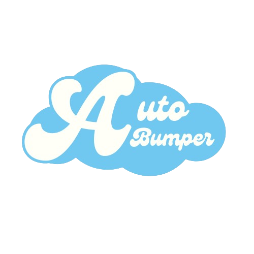

# Disboard Autobump

An automation project designed to trigger Disboard bump commands on a configured schedule, using a local Python runtime and a vendored discord.py-self implementation.

## Overview

Disboard Autobump helps streamline recurring bump actions in a selected Discord channel by:

- Reading settings from a local JSON configuration.
- Connecting through a self-bot style Discord client implementation.
- Finding and executing the bump application command.
- Automatically applying cooldown-based loop intervals between bump attempts.

## Features

- Configurable command prefix and bump cooldown.
- Channel-targeted bump execution.
- Lightweight single-file runtime entrypoint.
- Automatic command cache refresh for reliability.
- Rate-limit handling with retry delays.
- Simple batch scripts for install and run.

## Tech Stack

- Language: Python
- Runtime: asyncio event loop
- Discord Client: discord.py-self (vendored in this repository)
- Configuration: JSON
- OS Support: Windows-focused scripts

## Installation

1. Clone the repository.

~~~powershell
git clone https://github.com/Zectxr/disboard-autobump.git
cd disboard-autobump
~~~

2. Install dependencies.

~~~powershell
install.bat
~~~

3. Configure your settings in [config/config.json](config/config.json).

~~~json
{
	"token": "PUT YOUR TOKEN HERE",
	"prefix": "!",
	"channel_id": "YOUR_CHANNEL_ID",
	"cooldown_minutes": 150
}
~~~

## Usage

Run the project with either method below:

~~~powershell
run.bat
~~~

or

~~~powershell
python main.py
~~~

Expected behavior:

- The client logs in using your configured token.
- The bot searches for the bump application command in the configured channel.
- After successful execution, the task interval updates to your configured cooldown.

## Screenshots

Project preview:

## Roadmap

- Add structured logging with log levels and file output.
- Add startup validation for config keys and channel access.
- Add optional notification hooks for successful bump events.
- Add safer secrets workflow using environment variables.
- Add test coverage for config parsing and scheduler behavior.

## Contributing

Contributions are welcome.

1. Fork the repository.
2. Create a branch for your change.
3. Commit with clear messages.
4. Open a pull request with a concise description and testing notes.

Recommended contribution scope:

- Bug fixes with reproducible steps.
- Dependency and reliability improvements.
- Documentation and setup quality improvements.

## Disclaimer

Self-bot usage may violate Discord Terms of Service and can result in account moderation actions. Use this project at your own risk and only in environments where you are authorized to test.
