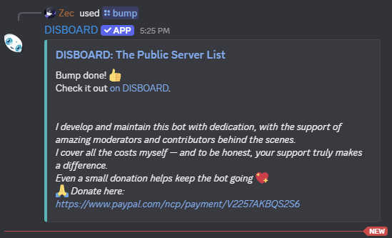

  

<h1 align="center">Disboard Autobump</h1>

  A focused automation project that triggers Disboard bump commands on a schedule,
  with configurable cooldowns and channel targeting.

  
  
  
  

## Overview

Disboard Autobump is built for developers who want a simple and reliable way to automate recurring bump actions in a specific Discord channel.

It works by reading runtime settings from your local config, connecting through a vendored discord.py-self client, fetching the bump application command, and running it on a cooldown-driven loop.

## Features

- Automated bump trigger with cooldown scheduling
- Config-based setup for token, channel, prefix, and interval
- Lightweight single entrypoint runtime
- Command cache refresh for resilient slash-command lookup
- Basic rate-limit handling for safer retries
- Windows-friendly install and run scripts

## Tech Stack

- Python (asyncio runtime)
- discord.py-self (bundled in repository)
- JSON-based configuration
- Batch scripts for local Windows workflow

## Installation

1. Clone the repository

~~~powershell
git clone https://github.com/Zectxr/disboard-autobump.git
cd disboard-autobump
~~~

2. Install dependencies

~~~powershell
install.bat
~~~

3. Update configuration in [config/config.json](config/config.json)

~~~json
{
	"token": "PUT YOUR TOKEN HERE",
	"prefix": "!",
	"channel_id": "YOUR_CHANNEL_ID",
	"cooldown_minutes": 150
}
~~~

## Usage

Start the app:

~~~powershell
run.bat
~~~

Alternative direct run:

~~~powershell
python main.py
~~~

Expected flow:

1. Client logs in using the configured token
2. Bot finds the bump command in the configured channel
3. On success, the cooldown interval is applied for the next run

## Screenshots

### Logo

### Runtime Preview

### Project Cover

## Roadmap

- Add startup validation for config and channel permissions
- Add structured logging (console + file)
- Add optional webhook notifications for successful bumps
- Add environment-variable secret loading support
- Add test coverage for config parsing and scheduler behavior

## Contributing Guidelines

Contributions are welcome and appreciated.

1. Fork the repository
2. Create a feature or fix branch
3. Keep commits focused and descriptive
4. Open a pull request with summary, rationale, and test notes

Good first contribution ideas:

- Error handling and diagnostics improvements
- Setup and documentation enhancements
- Reliability and scheduler behavior tuning

## Disclaimer

Self-bot usage may violate Discord Terms of Service and may lead to account restrictions. Use this project responsibly, only in environments where you have explicit authorization.
